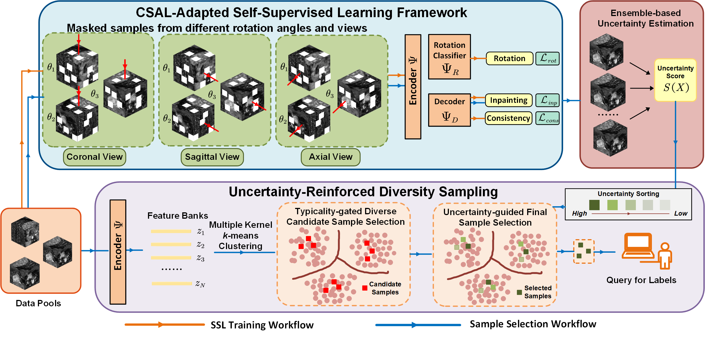

<div align="center">


### CSAL-3D: Cold-Start Active Learning for 3D Medical Image Segmentation via SSL-Driven Uncertainty-Reinforced Diversity Sampling

[](https://www.miccai.org/)
[](https://www.miccai.org/)
[](https://www.python.org/)
[](https://pytorch.org/)
[](https://monai.io/)
[](LICENSE)

**Official implementation** of our MICCAI 2025 paper, **shortlisted for the Best Paper & Young Scientist Award**.

Ning Zhu, Ping Ye, Lanfeng Zhong, Qiang Yue, Shaoting Zhang, Guotai Wang

*University of Electronic Science and Technology of China · West China Hospital · Shanghai AI Lab*

</div>

---

## Overview

**Cold-Start Active Learning (CSAL)** decides which scans to label with **only one chance to query the annotator and no labels or task model available beforehand**. **CSAL-3D** is a CSAL framework for 3D medical image segmentation that tightly couples SSL-based feature learning with uncertainty estimation, and combines diversity and uncertainty sampling in a single one-shot query.

<div align="center">
  
</div>

The framework comprises three tightly-coupled components:

### 1 · CSAL-Adapted Self-Supervised Learning
A Swin-UNETR backbone is pre-trained with three auxiliary tasks that exploit the multi-view geometry of 3D volumes (following SwinMM). Each cropped sub-volume is expanded into **3 views (axial / coronal / sagittal) × 3 rotations** and processed by a shared encoder feeding two heads — an inpainting decoder and a rotation classifier:

- **Image Inpainting** — reconstruct masked regions; also the basis for uncertainty estimation.
- **Rotation Prediction** — recover the applied rotation angle, encouraging view-invariant features.
- **Cross-View Consistency** — align reconstructions across rotations of the same view in canonical coordinates.

The training objective sums the three losses: `L = L_inp + L_rot + L_cons`.

### 2 · Ensemble-Based Uncertainty Estimation
Uncertainty is derived from the **ensemble of multi-view reconstructions**. Voxel-level uncertainty is the **variance** of the aligned reconstructed outputs; a **sliding window** then aggregates voxel scores into a single sample-level uncertainty score `S(X)`. Feature extraction and uncertainty estimation thus share one SSL model in a deeply-coupled manner.

### 3 · URDS — Uncertainty-Reinforced Diversity Sampling
A hierarchical one-shot query strategy that fuses diversity and uncertainty:

1. **Multiple-kernel k-Means** clusters the feature bank into `M` clusters (`M` = annotation budget).
2. **Typicality-gated candidate selection** — within each cluster, keep the top `N_cand` samples by *typicality* (inverse average cosine distance).
3. **Uncertainty-guided final selection** — among each cluster's candidates, pick the **most uncertain** sample by `S(X)`.

The resulting set is simultaneously **diverse** (covers the data distribution) and **uncertain** (focuses on ambiguous regions).

## Highlights

- **First** to combine diversity and uncertainty sampling in the CSAL setting.
- **Annotation-free, one-shot selection** — no labels and no task model required beforehand.
- **Unified SSL backbone** shared by feature extraction *and* uncertainty estimation.

## Repository Structure

```
CSAL-3D/
├── active_learning/         
│   ├── urds.py              
│   └── baselines.py         
├── data/                    
├── data_loading/            
├── transform/               
├── models/                  
├── network_training/        
├── inference/               
├── loss_functions/          
├── utils/                   
├── options/                 
├── assets/                  
└── scripts/                 
    ├── run_training_recon.py        
    ├── run_feature_extraction.py    
    ├── run_uncertainty_estimation.py
    ├── run_training.py              
    ├── run_inference.py             
    └── run_training_proxy.py        
```

## Installation

```bash
# 1. Clone
git clone https://github.com/HiLab-git/CSAL-3D.git
cd CSAL-3D

# 2. Create environment (Python 3.8+ recommended)
conda create -n csal3d python=3.9 -y
conda activate csal3d

# 3. Install dependencies
pip install -r requirements.txt
```

> **Note.** We use PyTorch **2.3.1** and MONAI **1.3+**. Install the PyTorch build matching your CUDA version from the [official selector](https://pytorch.org/get-started/locally/).

## Datasets

We evaluate on three tasks from the **[Medical Segmentation Decathlon (MSD)](http://medicaldecathlon.com/)**, following the COLosSAL splits:

| Task | Organ | Modality | Train / Val |
| :--- | :--- | :--- | :--- |
| Task01 | Brain Tumour | MRI (multi-modal) | 387 / 97 |
| Task02 | Heart | MRI | 16 / 4 |
| Task09 | Spleen | CT | 25 / 7 |

Download the raw data from the [official MSD website](http://medicaldecathlon.com/), then prepare it with the scripts in [`data/`](data/):

```bash
python data/data_download.py      # download MSD tasks via MONAI
python data/data_conversion.py    # convert NIfTI → preprocessed .npz
python data/generate_list.py      # build train / val splits
```

## Pipeline

All scripts share the unified options in [`options/options.py`](options/options.py).

### 1 · CSAL-adapted SSL pre-training

Pre-train the Swin-UNETR backbone with the inpainting + rotation + cross-view-consistency objective:

```bash
python scripts/run_training_recon.py -n ssl -o BrainTumour -c 2 -m mr
```

### 2 · Feature extraction

Extract 3D-aware features for every unlabeled volume:

```bash
python scripts/run_feature_extraction.py -n ssl -o BrainTumour -c 2 -m mr
# → ./BrainTumour/feats/Ours.npz
```

### 3 · Ensemble-based uncertainty estimation

Compute sample-level uncertainty `S(X)` from the multi-view reconstruction ensemble:

```bash
python scripts/run_uncertainty_estimation.py -n ssl -o BrainTumour -c 2 -m mr
# → ./BrainTumour/feats/Ours_scores.tsv
```

### 4 · URDS sample selection

Select the annotation set with **URDS** (our method):

```bash
python -m active_learning.urds urds \
    --organ BrainTumour \
    --feats  ./BrainTumour/feats/Ours.npz \
    --scores ./BrainTumour/feats/Ours_scores.tsv \
    --num-samples 20 --ncand 3
# → ./BrainTumour/plans/URDS_20.npz
```

Ablation variants:

```bash
# Diversity only — most typical sample per cluster
python -m active_learning.urds div-only --organ Heart --feats ./Heart/feats/Ours.npz --num-samples 4

# Uncertainty only — globally most uncertain samples
python -m active_learning.urds unc-only --organ Heart --feats ./Heart/feats/Ours.npz \
    --scores ./Heart/feats/Ours_scores.tsv --num-samples 4
```

### 5 · Segmentation training on the selected subset

Train the nnUNet segmentation model on the selected volumes via the generated plan:

```bash
python scripts/run_training.py -n csal_seg -o BrainTumour -c 2 -m mr \
    --plan ./BrainTumour/plans/URDS_20.npz
```

### 6 · Inference & evaluation

```bash
python scripts/run_inference.py -n csal_seg -o BrainTumour -c 2 -m mr --save_output
```

## Citation

If you find this work useful, please consider citing:

```bibtex
@inproceedings{zhu2025csal3d,
  title     = {CSAL-3D: Cold-Start Active Learning for 3D Medical Image
               Segmentation via SSL-Driven Uncertainty-Reinforced Diversity Sampling},
  author    = {Zhu, Ning and Ye, Ping and Zhong, Lanfeng and Yue, Qiang and
               Zhang, Shaoting and Wang, Guotai},
  booktitle = {International Conference on Medical Image Computing and
               Computer Assisted Intervention (MICCAI)},
  year      = {2025}
}
```

## Acknowledgement

Our codebase is built upon the excellent **[COLosSAL](https://github.com/han-liu/COLosSAL)** benchmark for cold-start active learning in 3D medical image segmentation, and the SSL design follows **[SwinMM](https://github.com/UCSC-VLAA/SwinMM)**. We also thank the [MONAI](https://monai.io/) and [Medical Segmentation Decathlon](http://medicaldecathlon.com/) communities.

## License

This project is released under the [MIT License](LICENSE).
